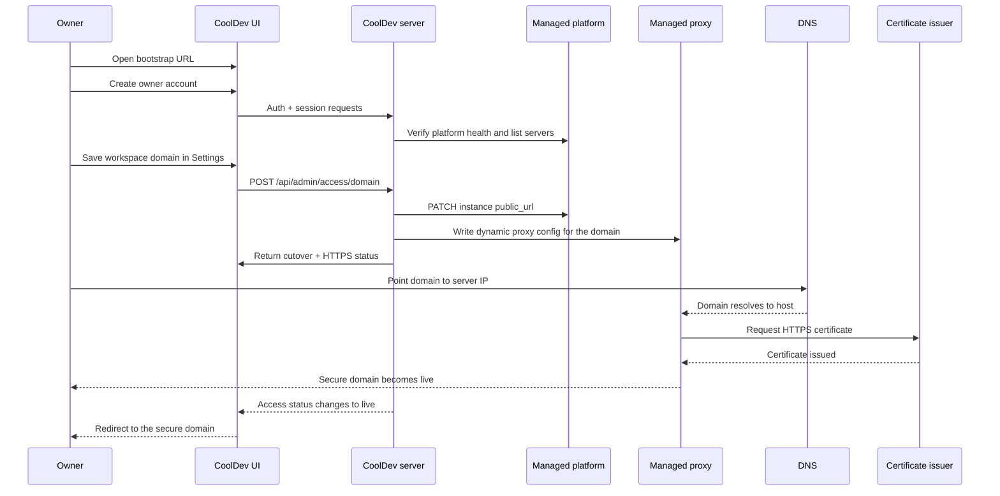

# CoolDev deployment diagram

This is the final product-first deployment shape for CoolDev.

## High-level architecture

```mermaid
flowchart LR
  Browser[User browser]
  Bootstrap[Bootstrap URL\nhttp://server-ip:port]
  Domain[Custom domain\nhttps://cooldev.example.com]
  Proxy[Managed proxy\nports 80 / 443]
  App[CoolDev server + UI\nAuth / Sessions / CSRF / Password reset\nDomain automation / Platform proxy]
  Platform[Managed platform API\ninternal network]
  Workloads[Apps / Databases / Services / Compose stacks]
  State[/var/lib/cooldev\nstate.json\ncooldev-config.json]
  ProxyConfig[/data/coolify/proxy\nmounted as /var/lib/cooldev/platform-proxy]
  DockerSock[/var/run/docker.sock]
  SMTP[SMTP provider\noptional]

  Browser --> Bootstrap --> App
  Browser --> Domain --> Proxy --> App
  App --> Platform --> Workloads
  App --- State
  App --- ProxyConfig
  App --- DockerSock
  App --> SMTP
```

## Bootstrap-to-domain transition



## Runtime mounts

```mermaid
flowchart TB
  subgraph Container[CoolDev container]
    App[CoolDev server]
  end

  State[/var/lib/cooldev/]
  ProxyMount[/data/coolify/proxy/]
  Socket[/var/run/docker.sock]

  State -->|mounted to| App
  ProxyMount -->|mounted to /var/lib/cooldev/platform-proxy| App
  Socket -->|mounted to| App
```

## Product behavior summary

- Users start on the bootstrap URL immediately after install.
- CoolDev owns owner auth, sessions, CSRF, password reset, and product flow.
- The managed platform stays behind CoolDev and is not part of the normal user journey.
- Saving a domain triggers automatic 80/443 cutover and HTTPS provisioning.
- The bootstrap URL remains available as a fallback path while DNS and HTTPS finish.
